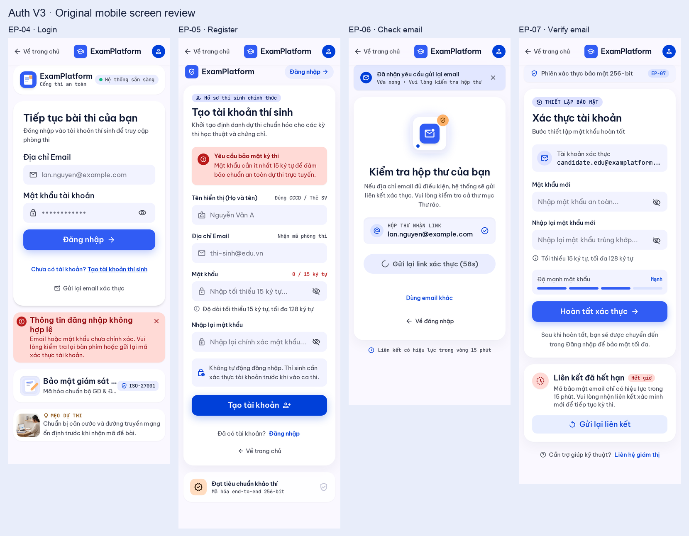

# Review UI Auth V3 — 2026-10-08

Dự án [ExamPlatform UI Design](https://stitch.withgoogle.com/projects/18257628123124303955). Phạm vi: review 8 ảnh gốc desktop/mobile của EP-04–07 theo [Prompt Auth](stitch-page-prompts-v3/01-auth.md) và hướng thị giác [Dashboard V2 / V3](templates/stitch-v3/README.md). Không sửa ứng dụng, không gửi refinement lên Stitch.

**Quyết định sau review:** người dùng đồng ý lưu nhóm này làm [template Auth V3](templates/auth-v3/README.md), hoãn các lỗi sang giai đoạn code và tiếp tục Prompt 02. [Checklist triển khai](templates/auth-v3/implementation-notes.md) giữ các mục còn mở; không suy ra chức năng hay tương tác đã được nghiệm thu từ việc chọn style.

**Kiểm tra lại theo yêu cầu tiếp theo:** Stitch hiện có 30 screen; nhóm Auth vẫn đúng 8 screen ID đã lưu, tên/kích thước và nguồn screenshot không đổi so với lần lấy trước. [Inventory recheck](evidence/stitch-auth-review-2026-10-08/inventory-recheck.json) ghi đối chiếu metadata; không tải lại bytes ảnh và không coi đây là kiểm chứng tương tác. Kết luận và AUTH-01–09 giữ nguyên. Sáu màn mới thuộc EP-08–10 (Danh sách đề/Chi tiết đề/Hồ sơ), chưa được review trong phạm vi Auth này.

## Kết luận

**Đề xuất giữ hướng thiết kế và tiếp tục Catalog/Profile.** Bốn page đều có bản desktop/mobile, form chính rõ, palette Cobalt–Apricot và card mềm tương đối đồng bộ với mẫu đã chọn. Login/Register desktop có illustration riêng liên quan đến bài thi; Check email là màn gọn và dễ hiểu nhất trong nhóm.

Các mẫu đủ để tham khảo thị giác. **Luồng Auth chưa đủ trạng thái để chốt triển khai:** phần lớn variants trên desktop là các card mô tả đặt dưới page, chưa phải bản form hoàn chỉnh cho từng trạng thái. Mobile còn lẫn trạng thái hợp lệ và lỗi trong cùng ảnh. Theo quyết định hiện hành, lưu lại các vấn đề để xử lý khi code; hoàn thiện bộ state trước khi bắt đầu port toàn bộ UI.

## Đánh giá từng page

| Page | Desktop | Mobile | Đề xuất |
| --- | --- | --- | --- |
| EP-04 — Login | Hai cột rõ; form nổi bật; giấy/bút nhiều lớp tạo chiều sâu | Form dễ đọc, CTA lớn; có hai vùng branding/header và lỗi nằm ngoài form | Giữ bố cục, gọn header và đặt lỗi gần hành động đăng nhập |
| EP-05 — Register | Bốn field và thứ bậc CTA hợp lý; illustration có bản sắc riêng | Banner đỏ đang diễn đạt quy tắc mật khẩu ngay khi form trống; header/brand lặp | Giữ form, chuyển quy tắc bình thường thành helper nhẹ; lỗi chỉ xuất hiện khi cần |
| EP-06 — Check email | Card trung tâm, phong bì và resend/cooldown dễ nhận biết | Thứ bậc rõ, nội dung chính tập trung; icon phong bì khác chất desktop nhưng cùng palette | Giữ hướng; bổ sung bản nhập email khi chưa có email để resend |
| EP-07 — Verify email | Form hai mật khẩu rõ; phần state showcase bên dưới làm page kéo dài | Form còn hoạt động cùng card “Liên kết đã hết hạn”; strength “Mạnh” khi input trống | Giữ hình thức form; tách valid/expired/pending/success thành trạng thái độc lập |

## Các lỗi hình thức và trạng thái cần ghi lại

1. **AUTH-01 — Showcase đang nằm trong sản phẩm.** Cả bốn desktop đều có vùng “Mô phỏng/Critical State Variants” giữa main và footer; Verify thêm cả bảng security tokens. Chuyển chúng sang frame handoff riêng. Giữ product page chỉ có trạng thái hiện hành, không copy các bảng thử lỗi vào frontend.
2. **AUTH-02 — Verify mobile lẫn valid và expired.** Ảnh có đủ hai input, meter và CTA hoàn tất, rồi ngay dưới là cảnh báo link hết hạn. Với link hết hạn, thay form bằng recovery phù hợp; trạng thái hợp lệ không có cảnh báo hết hạn. Đây là vấn đề hierarchy và state presentation, không chỉ sửa câu chữ.
3. **AUTH-03 — Mobile chưa có một header/brand thống nhất.** Login/Register có header trên cùng rồi thêm vùng logo/menu phía dưới; mark đổi giữa mũ tốt nghiệp, khiên và phiếu thi. Có nhiều điểm “Về trang chủ/Đăng nhập” lặp. Khi code, dùng một public header gọn và logo tạm thống nhất; các bản ảnh gốc được giữ nguyên.
4. **AUTH-04 — Phản hồi lỗi chưa đặt đúng ngữ cảnh.** Login mobile đặt alert sau toàn bộ card; Register mobile dùng alert đỏ cho quy tắc mật khẩu trước khi có thao tác lỗi. Dùng helper trung tính cho quy tắc, field error sát input và form error gần đầu form/CTA. Normal state không luôn mang cảnh báo đỏ.
5. **AUTH-05 — Chưa đủ form states thật.** Login cần submitting/rate-limit/network error thể hiện ngay trong form; Register thiếu bản tên quá dài và error đặt tại field. Check email cần form email khi reload/không có giá trị, cùng ready/pending/cooldown/error thực tế. Verify cần recovery nhập email, success và trạng thái đang đăng nhập tài khoản khác. Card kể về state chưa thay thế frame của state.
6. **AUTH-06 — Một số chi tiết làm màn hơi nặng và thiếu đồng bộ.** Monospace/all-caps dùng cả cho đoạn giải thích; nhiều chip/mã kỹ thuật và badge cạnh tranh với form. Button mobile có sắc xanh đậm hơn desktop; illustration mobile pha ảnh thật và icon khác bộ. Khi port, chuẩn hóa tokens, chữ body và icon; dùng monospace cho timer/mã có ích, tiết chế nội dung phụ.
7. **AUTH-07 — Meter và thông tin tài khoản cần phản ánh state.** Verify mobile hiện “Mạnh” trong form trống, email bị ellipsis; Login mobile có các title/meta bị cắt ở card phụ. Empty password không mang mức strength; cho đọc được email khi cần xác nhận đúng tài khoản, cho text quan trọng wrap thay vì cắt.

## Nội dung để đối chiếu sau

Theo yêu cầu người dùng, không lấy copy làm lý do yêu cầu thiết kế lại. Ghi riêng các phần Stitch tự thêm để không port nhầm: ISO/chứng nhận SSL/E2E, đồng bộ mili giây/multi-region, AI giám sát/sinh trắc học, chứng chỉ/CAT, mã phòng thi/CCCD và link System Diagnostics. Thời hạn link đang mâu thuẫn: Check email/mobile ghi 15 phút, Verify desktop có 24 giờ; contract Identity hiện là 30 phút. Verify không được báo đã kích hoạt trước khi người dùng hoàn tất form. Nội dung này phải sửa theo product/API contract khi triển khai, không trở thành tính năng được chấp thuận từ ảnh.

## Bước tiếp theo

Tiếp tục [Prompt 02 — Catalog/Profile](stitch-page-prompts-v3/02-catalog-profile.md), giữ hướng Auth này để tham khảo. Gom việc chuẩn hóa shared header, logo và form feedback vào lúc triển khai. Khi kết thúc lượt tạo page, [Prompt 09 — Shared states](stitch-page-prompts-v3/09-shared-states-handoff.md) cần tạo frame thật cho các trạng thái còn thiếu và tách handoff khỏi sản phẩm.

## Bằng chứng và giới hạn

[Bản lưu ảnh gốc và screen IDs](evidence/stitch-auth-review-2026-10-08/README.md), [manifest/hash](evidence/stitch-auth-review-2026-10-08/manifest.json). Đã kiểm tra đủ 8 ảnh PNG, kích thước đúng metadata Stitch và hash đúng bản lưu. Review dựa trên ảnh: chưa kiểm tra click, keyboard/focus, responsive thực, contrast được đo hoặc motion. Các URL HTML export chuyển sang Google sign-in nên phản hồi đó đã bị loại bỏ; không coi chúng là source của thiết kế.

