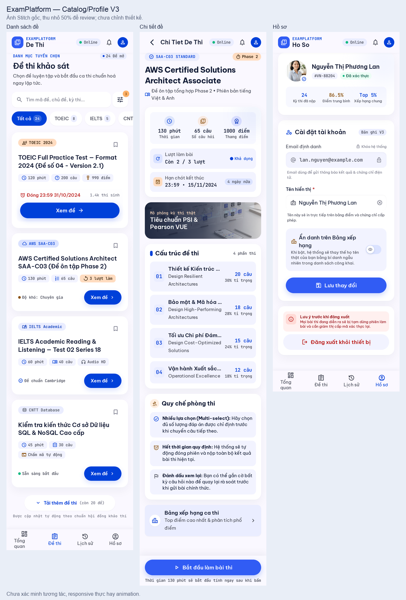

# Review UI Danh sách đề, Chi tiết đề và Hồ sơ — 2026-10-08

Dự án [ExamPlatform UI Design](https://stitch.withgoogle.com/projects/18257628123124303955). Phạm vi: sáu ảnh gốc desktop/mobile của EP-08–10, đối chiếu [Prompt 02](stitch-page-prompts-v3/02-catalog-profile.md), [design spec](design-spec.md) CA-02/03/10 và frontend hiện hành. Đây là review; chưa chọn nhóm này làm template và chưa sửa ứng dụng hay gửi refinement lên Stitch.

## Kết luận

**Đề xuất giữ hướng thị giác của cả ba page.** Rail trắng, card mềm, canvas sáng, CTA Cobalt và điểm nhấn Apricot tương đối đồng bộ với Dashboard V2. Thứ bậc nội dung rõ; mobile xếp nội dung theo chiều dọc thay vì thu nhỏ desktop. Các page cũng không đặt bảng thử trạng thái vào nội dung sản phẩm như một số mẫu Auth.

**Đã có đủ sáu màn chính, chưa đủ bộ trạng thái để chốt toàn bộ chức năng.** Inventory ở lần lấy ảnh có 30 screen, trong đó sáu screen thuộc EP-08–10; chưa thấy frame riêng cho xác nhận bắt đầu thi, conflict hồ sơ và các trạng thái loading/empty/error được yêu cầu. Không thể xác nhận hành vi của control bằng ảnh tĩnh.

Điểm cần sửa rõ nhất là switch Hồ sơ mobile đang diễn đạt “ẩn danh” thay vì “tham gia bảng xếp hạng”. Đây là ý nghĩa của control, cần thống nhất trước khi port. Các lỗi logo, dấu tiếng Việt, text bị cắt và chiều sâu 2.5D có thể ghi lại để xử lý lúc code theo quyết định trước của người dùng.

## Đánh giá từng page

| Page | Điểm tốt | Phần cần hoàn thiện | Đề xuất |
| --- | --- | --- | --- |
| EP-08 — Danh sách đề | Desktop grid hai cột; mobile một cột, chips dễ nhận biết; card có thông tin chính và nút xem đề; có tải thêm | Search desktop quá hẹp; tên dài bị cắt; card mobile chưa nhất quán CTA và lịch/chính sách; chưa có frame rỗng/tải/lỗi hoặc filter sheet | Giữ khung trang, chuẩn hóa một cấu trúc card và bộ filter phù hợp API |
| EP-09 — Chi tiết đề | Desktop main + summary bên phải; mobile đưa thông tin chính lên sớm; cấu trúc từng phần và CTA bắt đầu rõ | Thiếu frame xác nhận bắt đầu, tiếp tục lượt đang làm, chưa mở/đã đóng/hết lượt; số điểm từng phần và lịch/múi giờ chưa đầy đủ; mobile cắt tên phần | Giữ bố cục, bổ sung dialog và các trạng thái trước khi chốt luồng |
| EP-10 — Hồ sơ | Email chỉ đọc, tên có thể sửa, nút lưu rõ; logout nằm trong vùng riêng; switch desktop diễn đạt đúng opt-in | Mobile đổi switch thành “ẩn danh”; chưa có lưu đang gửi/thành công/lỗi và conflict giữ bản đang sửa; giới hạn tên desktop ghi 60 thay vì 80 | Giữ form, thống nhất ý nghĩa control giữa hai viewport và bổ sung feedback |

## Các vấn đề còn mở

- [ ] **CP-01 — P1 — Switch Hồ sơ mobile sai ý nghĩa.** Desktop là “Tham gia hiển thị trên Bảng xếp hạng kỳ thi”; mobile là “Ẩn danh trên Bảng xếp hạng”. Dùng cùng một control “Tham gia bảng xếp hạng”, mặc định tắt. Khi bật, kết quả tốt nhất có thể xuất hiện với bí danh trên bảng được mở. Không diễn đạt rằng khi tắt sẽ công khai tên thật. Đối chiếu `Profile.leaderboardOptIn` trong [DTO](../../apps/web/src/shared/api/dto.ts) và CA-10.
- [ ] **CP-02 — P1 — Chưa có frame review xác nhận bắt đầu thi.** Cần dialog nền page thật, thời lượng, lịch đóng, vào muộn có thể ít thời gian, quy tắc nhiều lựa chọn, tiêu thụ lượt sau khi bắt đầu thành công, hết giờ nộp các đáp án đã lưu; checkbox đã đọc và hai CTA quay lại/bắt đầu. Thêm pending/error, có lượt đang làm để tiếp tục, chưa mở/đã đóng/hết lượt. [Chi tiết đề hiện hành](../../apps/web/src/features/catalog/exam-detail-page.tsx) đã có bước xác nhận; port cần giữ hành vi đó.
- [ ] **CP-03 — P1 — Chưa có frame review phản hồi lưu và conflict Hồ sơ.** Cần trạng thái đang lưu, thành công, lỗi và phản hồi khi kết quả lưu chưa được xác nhận. Conflict phải giữ bản đang sửa, so sánh giá trị mới nhất và cho người dùng chọn tải lại hoặc xác nhận áp dụng lại. Thêm xác nhận rời trang/đăng xuất khi có thay đổi chưa lưu; giải thích rõ nút “Khôi phục” nếu giữ. Không biến việc refetch thành xóa draft. Đối chiếu [Profile hiện hành](../../apps/web/src/features/profile/profile-page.tsx).
- [ ] **CP-04 — P2 — Danh sách đề thiếu states và không đồng nhất thông tin card.** Chưa có frame riêng cho skeleton, danh mục rỗng với xóa bộ lọc, lỗi có retry, tải thêm đang gửi và filter sheet mobile. Card giữa desktop/mobile cần cùng trường chính: danh mục, tên, thời lượng, số câu, lịch mở/đóng, quyền xem lời giải, xem đề. Nếu giữ filter icon có badge trên mobile, phải rõ sheet mở ra những lựa chọn nào và cách reset.
- [ ] **CP-05 — P2 — Dữ liệu/tính năng tự thêm chưa có nguồn contract.** Search toàn bộ, bộ lọc nâng cao, bookmark, số người tham gia, tổng số đề, điểm trung bình, xếp hạng chung và chứng chỉ chưa có nguồn từ các API của ba page này. Browse hiện dùng category và cursor; nếu tìm trong dữ liệu đã tải thì ghi rõ phạm vi. Chi tiết công khai có `attemptLimit`, không có số lượt còn lại; không dựng “còn 2/3 lượt” từ một trang history. Khi chưa có nguồn, hiển thị giới hạn và để server kiểm tra lúc bắt đầu. Đây là việc mapping dữ liệu lúc code, không tự mở rộng backend từ mockup.
- [ ] **CP-06 — P2 — Text dài và CTA chưa nhất quán.** Cho title/section quan trọng wrap thay vì ellipsis khi còn chỗ; mở rộng search desktop đang bị ép nhỏ. Mobile list có card dùng CTA toàn chiều ngang, card dùng nút nhỏ bên phải; chọn một quy tắc nhất quán. Chuẩn hóa bottom nav để “Tổng quan” không tạo nhịp cao thấp bất thường; xác minh vùng chạm và khoảng đệm cho sticky CTA khi triển khai.
- [ ] **CP-07 — P2 — Thông tin chi tiết và ràng buộc form cần đủ.** Hiện cấu trúc đề chủ yếu là số câu và tỷ trọng; thêm điểm từng phần từ `sections[].possible`, version rõ trên mobile, lịch mở/đóng kèm múi giờ. Tên hiển thị dùng giới hạn 1–80 ký tự theo code/contract thay vì counter 60. Link bảng xếp hạng chỉ hiện khi được bật cho đúng version. Không coi thời lượng danh định là thời gian thực tế còn lại khi vào gần giờ đóng.
- [ ] **CP-08 — P2 — Nội dung mô tả hành vi cần sửa theo spec khi code.** Mobile detail nói phải chọn đúng số lượng đáp án trước khi chuyển câu; nền tảng không tiết lộ số đáp án đúng và không chặn chuyển câu vì điều này. Đăng xuất không tạm dừng deadline và không có luồng giám thị cấp mã xác thực lại. Hết giờ chỉ nộp đáp án đã lưu đúng hạn; không hứa nhận toàn bộ draft. Các phần AI/giám sát, audio/coding, điểm TOEIC/IELTS chính thức, ngưỡng đạt, PSI/Pearson VUE và chứng chỉ là copy/capabilities chưa được chấp thuận. Theo yêu cầu trước, ghi riêng để xử lý sau, không lấy chúng làm lý do thiết kế lại cả page.
- [ ] **CP-09 — P3 — Chiều sâu và branding còn nhẹ.** Batch này chủ yếu tạo chiều sâu bằng shadow/gradient; ít illustration giấy xếp lớp hơn Auth. Có thể thêm một điểm nhấn giấy/bút 2.5D nhỏ ở hero, giữ form và card dễ đọc. Banner ảnh thật PSI/Pearson VUE ở detail mobile khác hướng illustration đã chọn; thay bằng tài sản riêng hoặc bỏ khi code. Mobile còn mark dấu hỏi và title “De Thi/Chi Tiet De Thi/Ho So”; chuẩn hóa logo tạm và tiếng Việt có dấu. Chưa đo hoặc xác nhận motion từ ảnh.

## Coverage và bước tiếp theo

| Nhóm | Đã xem | Chưa có frame riêng trong inventory để review |
| --- | --- | --- |
| Danh sách đề | Normal desktop/mobile | Loading, empty, error, load-more pending, mobile filter sheet |
| Chi tiết đề | Normal desktop/mobile | Start confirmation desktop/mobile, pending/error, resume, chưa mở/đã đóng/hết lượt |
| Hồ sơ | Normal desktop/mobile | Pending/success/error/unconfirmed save, conflict desktop/mobile, xác nhận rời khi còn thay đổi |

Giữ cả sáu ảnh làm bằng chứng review, trạng thái **chờ quyết định chọn template**. Có thể giữ hướng này và gom các states còn thiếu vào đợt hoàn thiện chung; việc tạo các nhóm page khác không cần chờ sửa logo/overlap nhỏ. Nhóm kế trong kế hoạch là [Prompt 03 — Status, Result, Review, History, Leaderboard](stitch-page-prompts-v3/03-results-history-ranking.md). Review này không gửi prompt mới và không tự chọn sáu ảnh làm baseline đã duyệt.

## Bằng chứng và kiểm chứng

[Sáu ảnh gốc/screen IDs](evidence/stitch-catalog-profile-review-2026-10-08/README.md), [manifest](evidence/stitch-catalog-profile-review-2026-10-08/manifest.json). Đã xem đủ sáu PNG; xác minh kích thước/hash và liên kết tài liệu, đối chiếu registry với router. Không chạy test ứng dụng vì chỉ lưu bằng chứng và ghi review, không thay source.

Giới hạn: review từ screenshot; chưa xác minh click, focus/keyboard, responsive thực, contrast bằng đo đạc, sticky behavior hay animation. Việc nhìn thấy button/switch không xác nhận tính năng hoạt động. Ảnh được lưu nguyên bản; ảnh tổng quan chỉ ghép và thu nhỏ để so sánh.

