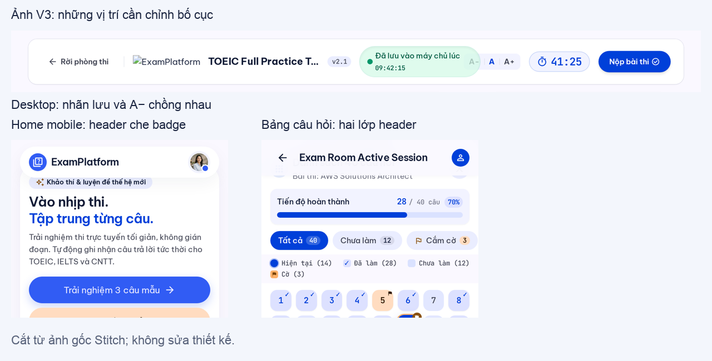

# Review Stitch — Visual Refinement V3

Ngày: 2026-10-08. Dự án: [ExamPlatform UI Design](https://stitch.withgoogle.com/projects/18257628123124303955), ID `18257628123124303955`.

## Phạm vi và bằng chứng

Review thị giác theo [prompt V3](stitch-visual-refinement-v3-prompt-2026-10-08.md) và [mẫu Dashboard V2](templates/dashboard-v2/README.md). Không điều chỉnh thiết kế trên Stitch hoặc code ứng dụng; không review nội dung/semantics/API trong lượt này.

Đã đọc inventory và lấy ảnh gốc qua Stitch MCP. Có 16 mục: 9 mục trước và 7 mục V3 mới, gồm 5 màn chính, bản phòng thi mobile mở bảng câu hỏi và tài liệu handoff. [Manifest](evidence/stitch-v3-review-2026-10-08/manifest.json) ghi ID, kích thước ảnh thật và SHA-256. Ảnh desktop rộng 2560px, mobile 780px; quan sát ở tỷ lệ thiết kế tương ứng 1280px/390px. Các crop chỉ phục vụ review, ảnh gốc được giữ nguyên.

Phiên trình duyệt không khả dụng. Review dựa trên ảnh xuất và metadata, chưa xác nhận hành vi scroll/sticky, mở menu, focus, hit area, reduced motion hoặc animation. Các lỗi chồng lớp dưới đây hiện trực tiếp trong ảnh, không cần suy diễn từ mô tả của Stitch.

## Kết luận

**V3 tiến bộ, nhưng chưa nên chốt toàn bộ.** Giữ hướng Cobalt–Apricot và mẫu Dashboard desktop V2. Bố cục phòng thi desktop đã gọn hơn rõ rệt; Dashboard mobile đã có nội dung đầy đủ. Lượt chỉnh tiếp theo nên sửa cục bộ những chỗ lỗi thay vì dựng lại mọi trang.

| Màn | Screen ID | Đánh giá thị giác |
| --- | --- | --- |
| Home desktop V3 | `f5caae61539a43049ab56eea2b8b0c65` | Sạch hơn, nhưng điểm nhấn 2.5D chưa đủ rõ; logo lỗi trong ảnh xuất |
| Exam desktop V3 | `222db89535964fb9bc183ab05a92bab6` | Gần đạt; header còn chồng controls |
| Dashboard mobile V3 | `57c1dac4924d4d13b45d655c41dfc81c` | Đạt hướng bố cục; thiếu timer so với mẫu chuẩn |
| Home mobile V3 | `4e8b878555d148259ff0df819ae125a2` | Hero gọn hơn; header che một phần badge |
| Exam mobile V3 | `c513f61f97834bca9677e480c3d507b9` | Save label đã rõ; phần đầu và đáp án còn nặng |
| Exam mobile mở bảng câu hỏi | `bcbb21021bbd43e69353667502c1d359` | Chưa đạt do hai lớp header chồng nhau |
| Handoff V3 | `14291ca3ac9c4bff8ac9ee073df7ec9c` | Có mục Markdown riêng; chưa có ảnh showcase để đánh giá |

## Những điểm V3 làm tốt

- Phòng thi desktop đã bỏ cấu trúc ba thanh ngang của V2, đưa câu hỏi lên cao hơn và tách showcase khỏi trang làm bài.
- Dashboard mobile có card lượt thi, CTA, hướng dẫn thu gọn, lịch sử, đề gợi ý và navigation ở đáy; không còn frame rail trống giả làm bản mobile.
- Home desktop dùng card illustration trắng thay cho mảng tint lớn; các lớp giấy và bóng nhìn rõ hơn V2.
- Home mobile giảm chiều cao khối illustration, bỏ CTA đăng ký chen chúc trong header. Bài mẫu xuất hiện sớm hơn so với V2.
- Phòng thi mobile có nhãn “Đã lưu máy chủ” đọc được, cùng timer và nút nộp dễ tìm.
- Các màn V3 chính không còn thư viện variants/handoff nằm ở cuối trang sản phẩm.

## Các điểm cần sửa trước khi chốt

### 1. Header phòng thi desktop chồng thành phần — ưu tiên cao

Pill xanh “Đã lưu vào máy chủ lúc 09:42:15” lấn vào nút A−. Tên đề bị rút thành “TOEIC Full Practice T...” ngay ở bản desktop 1280px, trong khi logo chiếm thêm một vùng ngang. Một thanh gọn là đúng hướng, nhưng phân bổ chiều rộng chưa ổn.

Chỉnh: dành vùng độc lập cho tên đề/save/timer/nộp; gom cỡ chữ vào menu tiện ích nhỏ; giảm kích thước pill lưu và vùng brand. Không ép mọi control vào cùng hàng bằng cách để chúng chồng lên nhau. Cần một biến thể mở menu để chứng minh navigation và tiện ích có chỗ truy cập.

### 2. Bảng câu hỏi mobile bị chồng hai lớp header — ưu tiên cao

Header “Exam Room Active Session” phủ lên tiêu đề, thông tin đề và vùng đóng của bảng câu hỏi. Nhìn giống một màn độc lập bị header khác che, chưa tạo cảm giác sheet đặt trên phòng thi.

Chỉnh: chọn rõ sheet có backdrop và cạnh trên bo góc, hoặc drawer toàn màn; chỉ giữ một header trong lớp đang mở. Nút đóng nằm riêng, dễ thấy. Giữ phòng thi phía sau nhất quán; nếu là full-screen drawer thì thay thế header cũ.

Lưới hiện có 8 cột. Ô nhìn thấy ước tính khoảng 38px khi quy về frame 390px; chưa xác nhận vùng chạm thật từ ảnh. Nên dùng 6–7 cột hoặc thể hiện hit area tối thiểu 44px. Câu hiện tại đang đồng thời có nền xanh, viền cam, badge cờ và chấm cam; bớt chỉ báo trùng lặp để lưới nhẹ hơn.

### 3. Header Home mobile che badge — ưu tiên cao

Thanh logo/avatar đang đè lên mép trên badge “Khảo thí & luyện đề thế hệ mới”. V2 đã có vấn đề ở phần đầu; V3 cải thiện brand nhưng chưa xử lý hết khoảng cách.

Chỉnh: chừa khoảng trống thực sự dưới header cho hero. Nếu có sticky header, thể hiện cả trạng thái đầu trang và khi cuộn để tránh che headline/badge.

### 4. Logo bị lỗi trong các ảnh xuất — cần sửa

Home desktop, phòng thi desktop và một số footer hiển thị biểu tượng ảnh hỏng cùng alt text “ExamPlatform Logo”. Đây là vấn đề đã có ở V2 và còn tồn tại trong V3. Nó làm header lệch cân bằng và khiến mockup trông chưa hoàn thiện.

Chỉnh: dùng một logo/SVG/icon ổn định, cùng hình và cùng kích thước trên desktop/mobile; tránh vừa hiển thị alt text vừa lặp tên brand. Kiểm tra lại ảnh xuất sau khi thay asset.

### 5. Home chưa đạt mức 2.5D mong muốn — cần tinh chỉnh

Desktop đã có lớp giấy sau, bóng và bút Apricot. Tuy vậy mặt trước vẫn là hình chữ nhật phẳng nhìn gần chính diện; cạnh và độ dày chưa rõ. Mobile vẫn giống một card đáp án xếp lớp, thiếu sự đồng bộ với tổ hợp bút/giấy desktop.

Chỉnh riêng illustration: tăng phối cảnh nhẹ, thể hiện cạnh giấy/độ dày, tách bóng tiếp xúc giữa các lớp và giữ một hướng sáng. Giữ headline/CTA/bố cục đang có. Phần dưới Home vẫn khá đều với nhiều card cùng hình; đây là tinh chỉnh thẩm mỹ thứ yếu, sau các lỗi chồng lớp.

### 6. Dashboard mobile cần giữ timer của mẫu chuẩn — cần tinh chỉnh

Card lượt đang làm có giờ bắt đầu, hạn chót và CTA, nhưng không thấy timer đếm ngược như Dashboard desktop V2. Đây là thành phần quan trọng để quét nhanh card đang thi. Các CTA lịch sử cũng xuống hai dòng, trong khi điểm và trạng thái được chia vào nhiều khối tint.

Chỉnh: thêm timer nhỏ, rõ trong card đang thi; dành chiều rộng ổn định cho CTA lịch sử và giảm các nền tint lặp lại. Giữ cấu trúc một cột và thứ tự hiện tại.

### 7. Phòng thi mobile vẫn có quá nhiều phần đầu — cần tinh chỉnh

Có header tên trang riêng, hàng tên đề/timer/nộp, hàng trạng thái lưu rồi hàng cỡ chữ/giám sát trước câu hỏi. Nhãn lưu là tiến bộ, nhưng thêm header lớn làm mất diện tích đọc. Đáp án căn giữa, nhiều dòng và chiều cao khác nhau khiến khó quét hơn desktop căn trái. Nút mở danh sách câu hỏi ở đáy bị rút thành “Danh sách ...”.

Chỉnh: hợp nhất header trang vào thanh phòng thi; cỡ chữ đưa vào tiện ích; đáp án căn trái với checkbox cùng một vị trí; nút bảng câu hỏi dùng nhãn ngắn đủ rõ và không bị cắt. Những thay đổi nội dung hoặc tính năng phát sinh trong V3 để dành lượt review riêng, không coi là đã được chấp thuận trong review thị giác.

## Đề xuất chốt theo phần

1. Giữ Dashboard desktop V2 làm mẫu chuẩn.
2. Giữ bố cục Dashboard mobile V3, bổ sung timer và căn lại CTA lịch sử.
3. Giữ bố cục phòng thi desktop V3, sửa header trước khi chốt.
4. Giữ hướng Home, sửa logo/spacing mobile và nâng chất lượng illustration.
5. Chưa chốt phòng thi mobile và sheet mở cho đến khi xử lý các lớp header, cách căn đáp án và lưới câu.

Không cần đổi bảng màu hoặc regenerate toàn bộ. Sau lượt sửa cục bộ, review lại các vùng vừa sửa và các biến thể menu/sheet ở kích thước thực. Chưa xác nhận độ tương phản số học, accessibility, tương tác hoặc chuyển động; review này không đóng bất kỳ gate triển khai nào.
