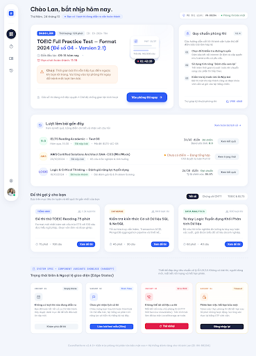

# Dashboard V2 — mẫu tham chiếu thị giác

Lưu ngày 2026-10-08 theo yêu cầu người dùng. Phạm vi: giữ Dashboard desktop V2 làm chuẩn thiết kế để điều chỉnh các màn còn lại trước khi sửa ứng dụng.

## Nguồn và bản lưu

- Dự án: [ExamPlatform UI Design](https://stitch.withgoogle.com/projects/18257628123124303955).
- Project ID: `18257628123124303955`.
- Màn chuẩn: **EP-02 — Bảng làm việc — Soft Bento (V2 Refined)**.
- Screen ID: `927f2e0d87ce4f89be5d55c3cb81606b`.
- Canvas frame quan sát được: `1280 × 1778`; metadata ảnh Stitch: `2560 × 3556`.
- [Ảnh tham chiếu](reference.png): ảnh preview gốc lấy từ Stitch MCP, `369 × 512`.
- [Ảnh đầy đủ](reference-full.png): bản nguồn `2560 × 3556` lưu thêm trong lần chốt bộ template V3.
- [Thông tin nguồn](source.json) và [tokens đề xuất dùng lại](tokens.json).

Hai màn cùng tên V2 tồn tại trong dự án. Màn `a65e52eabb5b41f4b3b72b50ca7f27aa` chỉ có rail và phần nội dung trống; **không dùng màn đó làm template**.

Bản lưu này là mẫu tham chiếu gồm ảnh và đặc tả; không phải component ứng dụng hoặc bản sao HTML hoàn chỉnh. ZIP chưa xác nhận tải thành công; đường tải HTML yêu cầu đăng nhập. Bản thiết kế gốc tiếp tục nằm trong dự án Stitch nêu trên.

## Những đặc điểm giữ làm chuẩn

1. Canvas sáng hơi ngả xám xanh; card trắng chiếm phần lớn diện tích. Màu đậm tập trung vào hành động và trạng thái chọn.
2. Rail trắng dạng viên nang, mảnh, tách khỏi mép canvas. Icon active nằm trong hình tròn ink đậm; icon còn lại dùng nét nhất quán.
3. Lời chào nằm ngoài card, là điểm mở đầu; ngày và trạng thái phụ có trọng lượng thấp hơn.
4. Hàng đầu bất đối xứng: card lượt đang làm khoảng hai phần ba, card hướng dẫn khoảng một phần ba. Hai card căn thẳng mép và cùng nhịp gutter.
5. Card lượt đang làm có thứ bậc: trạng thái → tên đề → thời gian → cảnh báo → hành động. Illustration giấy nhỏ nằm bên phải, có bóng và lớp; không tranh chỗ với tiêu đề.
6. CTA chính đặt ở cuối card lượt thi, dễ tìm. Ghi chú phụ nhẹ hơn. Không thêm dải màu lớn cạnh trái card.
7. Lịch sử dùng một card rộng phía dưới: mỗi hàng có tên đề, metadata, kết quả và hành động căn nhất quán; divider nhẹ.
8. Đề gợi ý tạo hàng ba card với cùng padding, hệ icon và vị trí hành động.
9. Bo góc mềm, shadow nhẹ, khoảng trắng có nhịp; tránh phủ tint lên mọi khối hoặc dùng nhiều badge ngang nhau.

## Tokens để áp dụng cho các màn tiếp theo

| Vai trò | Giá trị |
| --- | --- |
| Canvas | `#F3F6FC` |
| Surface | `#FFFFFF` |
| Primary / CTA | `#315CF4` |
| Accent Apricot | `#FFB36B` |
| Primary tint | `#E8EEFF` |
| Chữ chính / active rail | `#1B2540` |
| Chữ phụ | `#58627A` |
| Heading và body | Be Vietnam Pro |
| Timer, mã, một số số liệu | JetBrains Mono |
| Nhịp spacing | 8px |
| Card radius | Khoảng 20–24px |
| Gutter desktop | Khoảng 16–24px |
| Card padding desktop | Khoảng 24–32px |
| Rail desktop | Khoảng 64–80px; lấy 72px làm mốc |

Màu và font dựa trên brief/design system hiện có. Các khoảng kích thước là hướng dẫn để tái sử dụng, không phải toàn bộ giá trị CSS đã trích xuất từ bản gốc.

## Giới hạn của việc chốt mẫu

- Chốt hướng thị giác Dashboard desktop; nội dung, dữ liệu mẫu và các tuyên bố chức năng trong ảnh còn chờ lượt review riêng.
- Khu `SYSTEM SPEC / HANDOFF` dưới ảnh là tài liệu bàn giao, không phải phần của trang sản phẩm được chốt. Màn mới đặt showcase trên frame riêng.
- Mobile Dashboard chưa được chốt. Bản mobile cần thiết kế lại bố cục từ mẫu này.
- Motion chỉ là hướng dẫn: hover nâng nhẹ ở dashboard; không suy ra đã có animation chạy thật từ ảnh tĩnh.
- Mẫu không thay thế API/state contract hay nghiệm thu triển khai. Không thay đổi code, backend hoặc trạng thái roadmap trong lần lưu này.

## Lượt điều chỉnh tiếp theo

Dùng [prompt Visual Refinement V3](../../stitch-visual-refinement-v3-prompt-2026-10-08.md): giữ nguyên Dashboard desktop V2; chỉnh Home desktop, phòng thi desktop, hoàn thiện Dashboard mobile, tinh chỉnh Home/phòng thi mobile và đặt handoff ở frame riêng.

Quyết định mới hơn ngày 2026-10-08: người dùng chọn tiếp tục tạo các page còn lại và hoãn sửa lỗi đến lúc code. [Bộ template hiện hành](../stitch-v3/README.md) và [prompt các page tiếp theo](../../stitch-page-prompts-v3/README.md) là đầu mối cho lượt này; prompt refinement phía trên giữ làm lịch sử.
