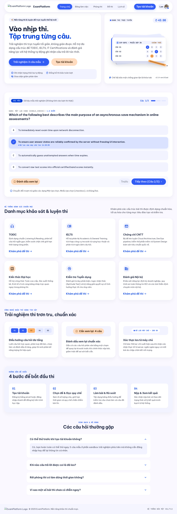

# Template UI hiện hành — Stitch V3

Chốt hướng thiết kế ngày 2026-10-08 theo yêu cầu người dùng: tiếp tục tạo các page còn lại, sau đó mới làm lại UI ứng dụng. Các lỗi hình thức được ghi riêng để xử lý khi code, không chặn việc thiết kế page mới.

## Bộ mẫu sử dụng về sau

| Mẫu | File | Vai trò |
| --- | --- | --- |
| Dashboard desktop V2 | [Ảnh đầy đủ](../dashboard-v2/reference-full.png) | Chuẩn workspace, rail trắng, tỷ lệ bento, nền/card/typography |
| Home desktop V3 | [Ảnh gốc](home-desktop-v3.png) | Chuẩn public header, hero, CTA và section |
| Exam desktop V3 | [Ảnh gốc](exam-desktop-v3.png) | Chuẩn bố cục tập trung làm bài |
| Dashboard mobile V3 | [Ảnh gốc](dashboard-mobile-v3.png) | Chuẩn workspace một cột và navigation mobile |
| Home mobile V3 | [Ảnh gốc](home-mobile-v3.png) | Chuẩn public mobile và khối bài mẫu |
| Exam mobile V3 | [Ảnh gốc](exam-mobile-v3.png) | Chuẩn controls/phòng thi mobile, cần xử lý lỗi khi code |
| Exam mobile mở bảng câu hỏi | [Ảnh gốc](exam-mobile-sheet-v3.png) | Tham khảo nội dung sheet; không sao chép lỗi chồng header |

Ảnh giữ nguyên bytes gốc Stitch ở 2560px desktop/780px mobile. [Manifest](manifest.json) ghi screen ID, nguồn, kích thước và SHA-256. Tỷ lệ bố cục tương ứng desktop 1280px và mobile 390px. [Tokens](../dashboard-v2/tokens.json) là hướng dẫn thiết kế, không phải CSS đã trích xuất.

## Cách dùng

- Bám style, hierarchy, typography, card geometry và màu của các mẫu. Dùng layout riêng phù hợp nhiệm vụ từng trang.
- Không regenerate các màn đã được chọn chỉ để mở rộng bộ UI.
- Các lỗi phải sửa khi triển khai nằm trong [implementation notes](implementation-notes.md).
- Nội dung và các tính năng tự phát sinh trong hình không trở thành hợp đồng chức năng. Khi code, đối chiếu product/API/state contract; template là chuẩn thị giác.
- Dùng [logo tạm](brand/README.md), có SVG nguồn và PNG để gửi Stitch. Chưa thay đổi ứng dụng hiện tại.
- Bộ [prompt tạo các page còn lại](../../stitch-page-prompts-v3/README.md) phủ các route sản phẩm hiện có. Chỉ bắt đầu port UI sau khi hoàn tất và duyệt bộ page.

## Dọn ảnh cũ

Theo yêu cầu người dùng, đã xóa 268 screenshot UI cũ không có tham chiếu trực tiếp được xác định trong tài liệu/source, cùng 25 ảnh/crop của lần review được thay bằng template hoặc không còn cần so sánh. Tổng 293 file, khoảng 54.21 MiB. Các ảnh cũ còn được tham chiếu và bằng chứng lỗi vẫn giữ; chúng là tư liệu lịch sử, không phải template hiện hành. [Danh sách và hash ảnh đã dọn](screenshot-cleanup.json).

Bản lưu này là bộ ảnh/đặc tả thiết kế để triển khai về sau, không phải component đã code hoặc bản export HTML đầy đủ.

Kiểm tra ngày 2026-10-08: 7 ảnh khớp hash/kích thước trong manifest; SVG và PNG logo đọc được; 9 khối prompt và registry phủ đủ 39 route pattern (gồm alias/redirect và route dev được ghi loại trừ); 293 ảnh trong ledger đã được xóa, không còn link Markdown trỏ đến chúng. Các link local trong bộ bàn giao hợp lệ; `git diff --check` cho các tài liệu được cập nhật đạt. Không chạy test ứng dụng vì lần này chỉ lưu asset và tài liệu.
